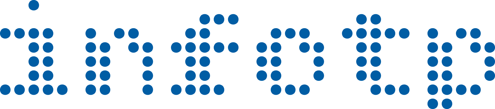
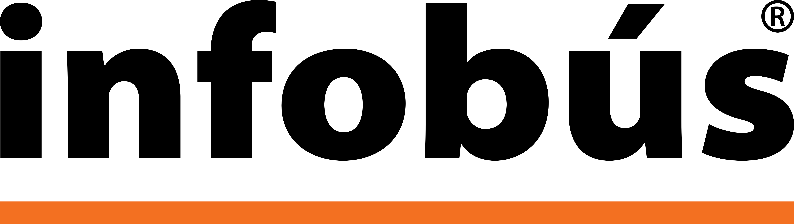
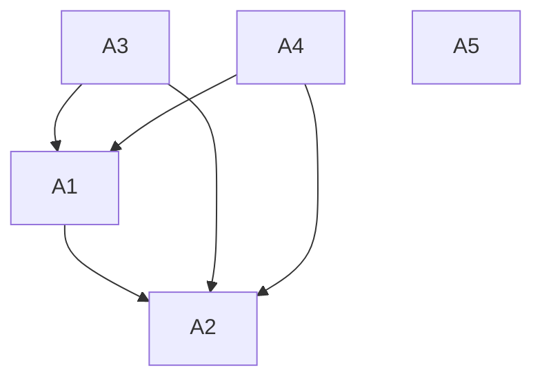
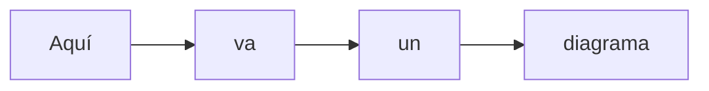

---
typography:
  - name: "Inter"
    url: "https://fonts.google.com/specimen/Inter"
  - name: "Bitcount Light"
    url: "https://fonts.google.com/specimen/Bitcount"
color_schema:
  sky_blue:
    pantone: "298 C"
    rgb: [0, 192, 243]
    hex: "#00C0F3"
  blue:
    pantone: "2945 C"
    rgb: [0, 93, 164]
    hex: "#005DA4"
  green:
    pantone: "7489 C"
    rgb: [109, 192, 103]
    hex: "#6DC067"
  yellow:
    pantone: "121 C"
    rgb: [255, 224, 106]
    hex: "#FFE06A"
  yellow_2:
    pantone: "108 C"
    rgb: [255, 221, 0]
    hex: "#FFDD00"
  yellow_3:
    pantone: "108 C"
    rgb: [255, 221, 0]
    hex: "#FFDD00"
  orange_1:
    pantone: "142 C"
    rgb: [229, 179, 101]
    hex: "#e5b365"
  orange_3:
    pantone: "151 C"
    rgb: [243, 112, 33]
    hex: "#F37021"
  green_4:
    pantone: "348 C"
    rgb: [0, 134, 65]
    hex: "#008641"
  yellow_4:
    pantone: "7409 C"
    rgb: [253, 185, 18]
    hex: "#FDB912"
  brown_2:
    pantone: "725 C"
    rgb: [123, 52, 0]
    hex: "#7B3400"
logos:
  - "UCR"
  - "EIE"
  - "SIMOVI"
  - "Databús"
  - "Infobús"
  - "InfoTP"
  - "MobilityData"
  - "GTFS"
  - "Google Maps"
  - "Moovit"
  - "Transit"
technologies:
  stack: "https://github.com/simovilab/context/blob/main/tech_stack.md"
  logos: "https://icones.js.org/collection/simple-icons"
page_dimensions:
  height: "8.5"
  width: "5.5"
  units: "in"
  comments: "Folded promotional leaflet (bi-fold) with half US letter size pages"
number_pages: 12
---

---

[ Página 1 (portada) ]

**Tecnología y comunicación para los sistemas de información del transporte público**

Diciembre 2025

---

[ Página 2 ]

### Tecnología

La **arquitectura tecnológica** de InfoTP es una solución de extremo a extremo para los sistemas de información del transporte público.

El desarrollo está dividido en dos partes:

#### Databús®

Recopila la información oficial y los datos de rastreo y telemetría de los vehículos para la publicación en tiempo real con la especificación **GTFS**, disponible para todas las aplicaciones compatibles, incluyendo Google Maps, Moovit, Transit y otros proveedores.

#### Infobús®

Consume datos **GTFS** y distribuye la información por múltiples canales, interfaces y protocolos para todas las partes del sistema, incluyendo las personas usuarias, operadores, planificadores, reguladores, investigadores y otros proveedores tecnológicos.

> Con más de veinte proyectos de código abierto, subsistemas e interfaces bien delimitados y una selección comprobada de tecnologías robustas usadas en entornos críticos, este desarrollo funciona como un mapa tecnológico y una columna vertebral para el ecosistema digital abierto del transporte público y las ciudades inteligentes.

---

[ Página 3 ]

### Comunicación

La **estrategia de comunicación** de InfoTP es una visión integral que promueve el uso del transporte público y ayuda a mejorar la satisfacción de las personas usuarias con el servicio. El diseño de la estrategia de comunicación en conjunto con la arquitectura tecnológica permite ofrecer información siempre **actualizada** y **consistente**.

La comunicación está enfocada en diversos canales:

- Medios digitales
- Medios impresos
- Señalética
- Redes sociales
- Atención al cliente

#### Diseño _nativo_

- **Nativo digital**: Todos los canales digitales son parte de la oferta de información.
- **Nativo móvil**: El diseño está orientado a las consultas desde dispositivos personales.
- **Nativo inclusivo**: La información oportuna y con diseño universal facilita el uso de todas las personas.
- **Nativo inteligente**: Las nuevas interfaces habilitan el uso de lenguaje natural para hacer consultas.
- **Nativo social**: Las redes sociales informan y crean comunidad alrededor del transporte público.
- **Nativo multilingüe**: El sistema elimina las barreras de lenguaje para los visitantes de cualquier parte del mundo.
- **Nativo tico**: Es parte de nuestros pueblos y ciudades, por eso el transporte público debe ser un orgullo tico.

---

[ Página 4 ]

### Visión

Construimos nuestra arquitectura con base en las recomendaciones de las organizaciones internacionales líderes en sistemas inteligentes de transporte público y arquitecturas de software. Está basada en un principio esencial:

Unicidad de la información: La información disponible para las personas usuarias es consistente, precisa, actualizada y proviene de una fuente única, a través de la mayor cantidad posible de canales de comunicación.

De aquí derivan otros principios importantes:

- Datos abiertos y estandarizados
- Arquitectura única para el sistema
- Interoperabilidad
- Independencia tecnológica

---

[ Página 5 ]

### Arquitectura

Sobre la base una arquitectura modular, nuestro sistema está preparado para incorporar aplicaciones futuras e interactuar con todos los proveedores tecnológicos del sistema.

#### Somos los especialistas de la especificación GTFS en Costa Rica

El diseño de InfoTP gira alrededor de GTFS (_General Transit Feed Specification_).

- Tenemos más de 5 años de experiencia en la implementación de GTFS _Schedule_ y GTFS _Realtime_.
- Somos miembros académicos de MobilityData, la organización internacional que dirige su evolución.
- Desarrollamos herramientas informáticas especializadas para su procesamiento y análisis en el transporte público costarricense.

---

[ Página 6 ]

### Datos

[A1, A2, A3... son un "badge"]

#### A1 | Databús®

- Recolección de datos de rastreo y telemetría de los vehículos.
- Procesamiento de datos de alta frecuencia en tiempo real.
- Publicación de _feeds_ (suministros de datos) de **GTFS** _Schedule_ y **GTFS** _Realtime_.

---

[ Página 7 ]

### Información

#### A2 | Infobús®

- Compilación de _feeds_ (suministros de datos) de **GTFS** de diferentes fuentes.
- Distribución de la información a diferentes servicios vía múltiples canales, interfaces y protocolos.
- Almacenamiento de datos históricos en bases de datos especializadas.
- Análisis de datos para optimización del servicio.

Servicios

- Página web informativa con información en tiempo real
- Aplicación móvil con información en tiempo real
- Sistema de pantallas con información en tiempo real
- Planificación de viajes (A a B)
- Búsquedas inteligentes con inteligencia artificial
- Búsquedas semánticas
- Y otros

---

[ Página 8 ]

### Administración

#### A3 | Infobús® Admin

- Edición con interfaz gráfica de usuario para la creación de _feeds_ (suministros de datos) **GTFS** _Schedule_.
- Validación de datos y generación automática de estimación de tiempos de llegada.
- Visualización de métricas de desempeño del sistema.
- Gestión de contenidos de los canales de comunicación.
- Simulación de datos de transporte para pruebas del sistema.
- Generación automática de rotulación (señalética).

[Aquí van unas imágenes de interfaces web y gráficos en una pantalla]

---

[ Página 9 ]

### Gestión

#### A4 | Databús® Admin

- Monitoreo del desempeño de la infraestructura digital del sistema.
- Atención de amenazas de seguridad y medidas de contingencia.

#### A5 | Herramientas auxiliares

- Herramientas de programación para Python
- Herramientas de programación para TypeScript
- Herramientas de programación para Rust

---

[ Página 10 ]

### Sistema

Utilizamos una cuidadosa selección de tecnologías maduras y de código abierto.

[Logos de las tecnologías del sistema]

-  Django
-  Celery
-  Apache Airflow
-  PostgreSQL
-  TimescaleDB
-  MongoDB
-  Redis
-  RabbitMQ
-  GraphQL Strawberry
-  Apache Fuseki
-  FastMCP
-  Strapi
-  Vue
-  Nuxt
-  Capacitor
-  Ionic
-  Grafana
-  Prometheus
-  Docker
-  OpenTelemetry
-  Polars
-  Apache Parquet

#### Lenguajes de programación

-  Python
  - Orquestación de procesos, análisis de datos e inteligencia artificial
-  TypeScript
  - Interfaces web y aplicaciones móviles
-  Rust
  - Procesos críticos de alto desempeño

Más información: https://github.com/simovilab/

---

[ Página 11 ]

### Ventajas

[Matriz de 4x3 (4 filas, 3 columnas)]

1. **Especialización**

Propuesta basada en normas, especificaciones, estándares y recomendaciones internacionales.

2. **Consistencia y unicidad**

La información es **consistente** entre sí y con los datos oficiales a partir de una **fuente única**.

3. **Gestión integral de la comunicación**

Manejo unificado de todos los puntos de contacto de las personas usuarias con el sistema.

4. **Flexibilidad de implementación**

Permite la **coexistencia con otros servicios** y proveedores del mercado.

5. **Implementación gradual**

El diseño modular permite la adición paulatina de nuevas funcionalidades.

6. **Soluciones a la medida**

En coordinación con las autoridades, el sistema puede satisfacer **demandas específicas**.

7. **Enfoque en seguridad y robustez**

El sistema tiene un diseño orientado a la **seguridad de los datos y la confiabilidad**.

8. **Respaldo académico**

Propuesta de la Escuela de Ingeniería Eléctrica en alianza con otras **instancias especializadas**.

9. **Garantía contractual**

Servicios brindados mediante un contrato con la Universidad de Costa Rica.

10. **Flexibilidad de financiamiento**

La arquitectura modular permite recibir financiamiento de distintas fuentes.

11. **Monetización del sistema**

Varias opciones de monetización del sistema que ayudan a financiar los servicios.

12. **Código abierto**

Uso extendido en la comunidad nacional e internacional por medio de un proyecto de código abierto.

---

[ Página 12 (contraportada) ]

El Laboratorio de Sistemas Inteligentes de Movilidad (SIMOVI) de la Escuela de Ingeniería Eléctrica (EIE) de la Universidad de Costa Rica (UCR) realiza investigación y desarrollo en sistemas inteligentes de transporte público. InfoTP es el resultado de la investigación en tecnologías y estándares aplicados al transporte público, el diseño de sistemas de ingeniería y el diseño de servicios, como una guía práctica de diseño e implementación para tomadores de decisiones.

En el 2026, SIMOVI desarrollará el plan piloto de un sistema de información del transporte público para el servicio de bus interno del campus central de la Universidad de Costa Rica, el cual será el primer sistema inteligente de transporte público del país y permitirá evaluar la propuesta de arquitectura tecnológica y la estrategia de comunicación en un ambiente de aplicación real.

**SIMOVI** 
**Laboratorio de Sistemas Inteligentes de Movilidad** 
Escuela de Ingeniería Eléctrica 
Facultad de Ingeniería 
Universidad de Costa Rica 
simovi@ucr.ac.cr

**Fabián Abarca Calderón** 
Coordinador SIMOVI 
fabian.abarca@ucr.ac.cr 

[Logo UCR]
[Logo EIE]
[Logo SIMOVI]

Derechos reservados &copy; 2025
 
Laboratorios de Sistemas Inteligentes de Movilidad
