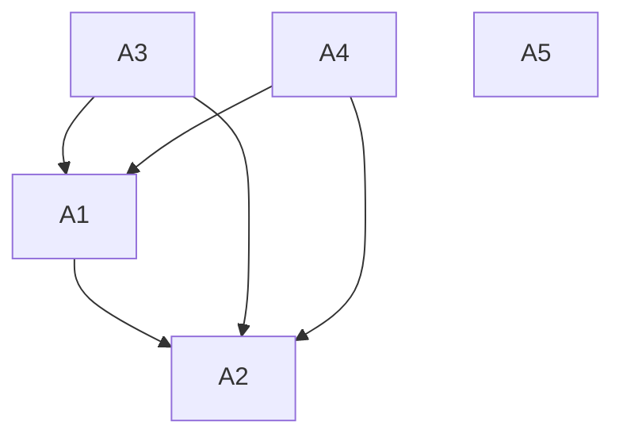

---
typography:
  - name: "Inter"
    url: "https://fonts.google.com/specimen/Inter"
  - name: "Bitcount Light"
    url: "https://fonts.google.com/specimen/Bitcount"
color_schema:
  sky_blue:
    pantone: "298 C"
    rgb: [0, 192, 243]
    hex: "#00C0F3"
  blue:
    pantone: "2945 C"
    rgb: [0, 93, 164]
    hex: "#005DA4"
  green:
    pantone: "7489 C"
    rgb: [109, 192, 103]
    hex: "#6DC067"
  yellow:
    pantone: "121 C"
    rgb: [255, 224, 106]
    hex: "#FFE06A"
  yellow_2:
    pantone: "108 C"
    rgb: [255, 221, 0]
    hex: "#FFDD00"
  yellow_3:
    pantone: "108 C"
    rgb: [255, 221, 0]
    hex: "#FFDD00"
  orange_1:
    pantone: "142 C"
    rgb: [229, 179, 101]
    hex: "#e5b365"
  orange_3:
    pantone: "151 C"
    rgb: [243, 112, 33]
    hex: "#F37021"
  green_4:
    pantone: "348 C"
    rgb: [0, 134, 65]
    hex: "#008641"
  yellow_4:
    pantone: "7409 C"
    rgb: [253, 185, 18]
    hex: "#FDB912"
  brown_2:
    pantone: "725 C"
    rgb: [123, 52, 0]
    hex: "#7B3400"
logos:
  - "UCR"
  - "EIE"
  - "SIMOVI"
  - "Databús"
  - "Infobús"
  - "InfoTP"
  - "MobilityData"
  - "GTFS"
  - "Google Maps"
  - "Moovit"
  - "Transit"
technologies:
  stack: "https://github.com/simovilab/context/blob/main/tech_stack.md"
  logos: "https://icones.js.org/collection/simple-icons"
page_dimensions:
  height: "8.5"
  width: "5.5"
  units: "in"
  comments: "Folded promotional leaflet (bi-fold) with half US letter size pages"
number_pages: 12
---

---

[ Página 1 (portada) ]

**Tecnología y comunicación para los sistemas de información del transporte público**

Diciembre 2025

---

[ Página 2 ]

### Tecnología

La **arquitectura tecnológica** de InfoTP es una solución de extremo a extremo para los sistemas de información del transporte público.

Está dividida en dos partes:

#### Databús®

Recopila la información oficial y los datos de rastreo y telemetría de los vehículos del servicio para la publicación en tiempo real con la especificación GTFS, disponible para todas las aplicaciones compatibles, incluyendo Google Maps, Moovit, Transit y otros proveedores.

#### Infobús®

Consume datos GTFS y distribuye la información por múltiples canales, interfaces y protocolos para todas las partes interesadas del sistema, como las personas usuarias, operadores, planificadores, reguladores, investigadores y otros proveedores tecnológicos.

> [!NOTE]
> Con más de veinte proyectos de código abierto, subsistemas e interfaces bien delimitados y una selección comprobada de tecnologías robustas usadas en entornos críticos, este desarrollo funciona como mapa tecnológico y columna vertebral de un ecosistema abierto del transporte público inteligente.

---

[ Página 3 ]

### Comunicación

La **estrategia de comunicación** de InfoTP es una visión integral del sistema para promover el uso del transporte público y mejorar la satisfacción con el servicio, explotando los beneficios de la información disponible.

Está enfocada en diversos canales:

- Medios digitales
- Medios impresos
- Señalética
- Redes sociales
- Atención al cliente

Su íntima integración con las tecnologías y los datos del servicio permite información siempre actualizada y una mejor experiencia de uso.

- **Nativo digital**: Todos los canales digitales son parte de la oferta de información.
- **Nativo móvil**: El diseño está orientado a las consultas desde dispositivos personales.
- **Nativo inclusivo**: La información oportuna y con diseño universal facilita la experiencia de uso.
- **Nativo inteligente**: Las interfaces habilitan el uso de lenguaje natural para hacer consultas.
- **Nativo social**: Las redes sociales y la atención al cliente crean comunidad alrededor del transporte público.
- **Nativo multilingüe**: El sistema elimina las barreras de lenguaje para visitantes de cualquier parte del mundo.
- **Nativo tico**: Es parte de nuestros pueblos y de nuestras ciudades: el transporte público debe ser orgullo tico.

---

[ Página 4 ]

### Visión

Construimos nuestra arquitectura con base en las recomendaciones de los líderes internacionales en sistemas inteligentes de transporte público y arquitecturas de software. Está basada en un principio esencial:

Unicidad de la información: La información disponible para las personas usuarias es consistente, precisa, actualizada y proviene de una fuente única, a través de la mayor cantidad posible de canales de comunicación.

De aquí derivan otros principios importantes:

- Datos abiertos y estandarizados
- Arquitectura única para el sistema
- Interoperabilidad
- Independencia tecnológica

---

[ Página 5 ]

### Arquitectura

Sobre la base una arquitectura modular, nuestro sistema está preparado para incorporar aplicaciones futuras e interactuar con todos los proveedores tecnológicos del sistema.

#### Somos los especialistas de la especificación GTFS en Costa Rica

- Tenemos más de 5 años de experiencia en la implementación de GTFS _Schedule_ y GTFS _Realtime_.
- Somos miembros académicos de MobilityData, la organización internacional que dirige su evolución.
- Desarrollamos herramientas informáticas especializadas para su procesamiento y análisis en el transporte público costarricense.

Sabemos que el transporte público debe ser parte de las ciudades inteligentes y sentamos las bases para esta interconectividad.

- Desarrollamos las especificaciones de las interfaces entre sistemas siguiendo las recomendaciones de la Arquitectura de Referencia del Transporte Colaborativo e Inteligente (ARC-IT) del Departamento de Transporte de Estados Unidos.

---

[ Página 6 ]

### Datos

#### A1 | Databús®

- Recolección de datos de rastreo de vehículos con la aplicación móvil Databús App, como una solución efectiva y de bajo costo.
- Recolección y procesamiento de datos en tiempo real de alta frecuencia.
- Publicación de suministros (feeds) de GTFS Schedule y GTFS Realtime.

---

[ Página 7 ]

### Información

#### A2 | Infobús®

- Compilación de suministros (_feeds_) de GTFS de diferentes fuentes y distribución de la información a diferentes servicios por múltiples canales y protocolos.
- Página web informativa con información en tiempo real
- Aplicación móvil con información en tiempo real
- Sistema de pantallas con información en tiempo real
- Planificación de viajes (A a B)
- Búsquedas inteligentes con inteligencia artificial
- Bases de datos especializadas para almacenamiento de datos históricos y análisis de datos para optimización del servicio
- Búsquedas semánticas

---

[ Página 8 ]

### Administración

#### A3 | Infobús® Admin

- Editor con interfaz gráfica de usuario para la creación de suministros (_feeds_) GTFS Schedule, con validación y generación automática de estimación de tiempos.
- Sistema de visualización de métricas de desempeño del sistema.
- Sistema de gestión de contenidos de los canales de comunicación
- Simulador de datos de transporte para pruebas del sistema
- Generador automático de rotulación (señalética)

[Aquí van unas imágenes de interfaces web y gráficos en una pantalla]

---

[ Página 9 ]

### Gestión

#### A4 | Databús® Admin

- Monitoreo del desempeño del sistema para optimizar el tiempo de operación.
- Atención de amenazas de seguridad y medidas de contingencia

#### A5 | Herramientas auxiliares

- Herramientas de programación para Python
- Herramientas de programación para TypeScript
- Herramientas de programación para Rust

---

[ Página 10 ]

### Sistema

[Lista de todas las [tecnologías en GitHub](https://github.com/simovilab/context/blob/main/tech_stack.md) en las secciones Backend Technologies, Frontend Technologies y DevOps Monitoring]

Lenguajes de programación

- Python: orquestación de procesos, análisis de datos e inteligencia artificial
- TypeScript: interfaces web y aplicaciones móviles
- Rust: procesos críticos de alto desempeño

> [!NOTE]
> Más información: https://github.com/simovilab/

---

[ Página 11 ]

### Ventajas

**Especialización**

La arquitectura tecnológica de la propuesta está basada en normas, especificaciones, estándares y recomendaciones internacionales en transporte público inteligente. **Somos los únicos expertos en el país**.

**Consistencia y unicidad**

Toda la información del servicio dirigida al público es **consistente** entre sí y con los datos oficiales a partir de una **fuente única**.

**Gestión integral de la comunicación**

El manejo unificado de todos los "puntos de contacto" (**diseño del servicio**) de las personas usuarias con el sistema mejora significativamente su experiencia.

**Flexibilidad de implementación**

Permite la **coexistencia con otros servicios** y proveedores del mercado, facilitando una implementación gradual.

**Soluciones a la medida**

En coordinación estrecha con las autoridades, el sistema implementado puede satisfacer las **demandas específicas** de las partes interesadas.

**Enfoque en seguridad y robustez**

El sistema tiene un diseño orientado a la **seguridad de los datos y la confiabilidad**.

**Respaldo académico**

Esta propuesta está hecha por la Escuela de Ingeniería Eléctrica en alianza con LanammeUCR, ProDUS y otras **instancias especializadas** de la Universidad de Costa Rica.

**Garantía contractual**

Cualquier servicio puede ser brindado mediante un **contrato de las partes interesadas**, con una definición clara de **plazos y entregables**.

**Flexibilidad de financiamiento**

La arquitectura modular puede recibir financiamiento de distintas fuentes. Inclusive, la propuesta incluye varias opciones de monetización que pueden ayudar a financiar parte de los servicios.

**Código abierto**

Uso extendido a la comunidad nacional e internacional, con un impacto positivo en la reputación del transporte público en Costa Rica.

---

[ Página 12 (contraportada) ]

El Laboratorio de Sistemas Inteligentes de Movilidad (SIMOVI) de la Escuela de Ingeniería Eléctrica (EIE) de la Universidad de Costa Rica (UCR) realiza investigación y desarrollo en sistemas inteligentes de transporte público. InfoTP es el resultado de la investigación en tecnologías y estándares aplicados al transporte público, el diseño de sistemas de ingeniería y el diseño de servicios, como una guía práctica de diseño e implementación para tomadores de decisiones.

Durante el año 2026, SIMOVI desarrollará el plan piloto de un sistema de información del transporte público para el servicio de bus interno del campus central de la Universidad de Costa Rica, el cual será el primer sistema inteligente de transporte público del país y permitirá evaluar la propuesta de arquitectura tecnológica y la estrategia de comunicación en un ambiente de aplicación real.

**SIMOVI** 
**Laboratorio de Sistemas Inteligentes de Movilidad** 
Escuela de Ingeniería Eléctrica 
Facultad de Ingeniería 
Universidad de Costa Rica 
simovi@ucr.ac.cr

**Fabián Abarca Calderón** 
Coordinador SIMOVI 
fabian.abarca@ucr.ac.cr 

[Logo UCR]
[Logo EIE]
[Logo SIMOVI]

Derechos reservados &copy; 2025
 
Laboratorios de Sistemas Inteligentes de Movilidad
