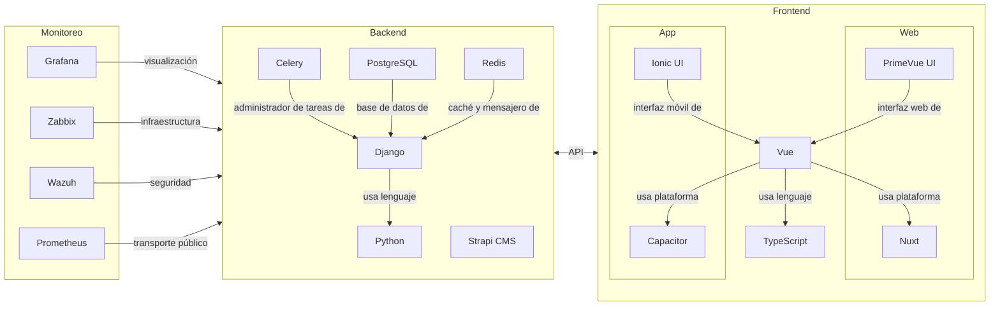

# Software

::: info Puntos clave

- Lista de conclusiones importantes o mensajes clave (_key takeaways_)
- Síntesis de toda esta página

:::

## Tecnologías web

```mermaid
flowchart LR
    subgraph Backend
        Py[Python]
        D[Django]
        C[Celery]
        P[PostgreSQL]
        R[Redis]
        S[Strapi CMS]
    end
    subgraph Monitoreo
        G[Grafana]
        Z[Zabbix]
        W[Wazuh]
        Pro[Prometheus]
    end
    subgraph Frontend
        TS[TypeScript]
        V[Vue]
        subgraph Web
        PV[PrimeVue UI]
        N[Nuxt]
        end
        subgraph App
        I[Ionic UI]
        Ca[Capacitor]
        end
    end

    D --"usa lenguaje"--> Py
    C --"administrador de tareas de"--> D
    P --"base de datos de"--> D
    R --"caché y mensajero de"--> D
    G --"visualización"--> Backend
    Z --"infraestructura"--> Backend
    W --"seguridad"--> Backend
    Pro --"transporte público"--> Backend
    Backend <--API--> Frontend
    V --"usa lenguaje"--> TS
    V --"usa plataforma"--> N
    V --"usa plataforma"--> Ca
    PV --"interfaz web de"--> V
    I --"interfaz móvil de"--> V
```
