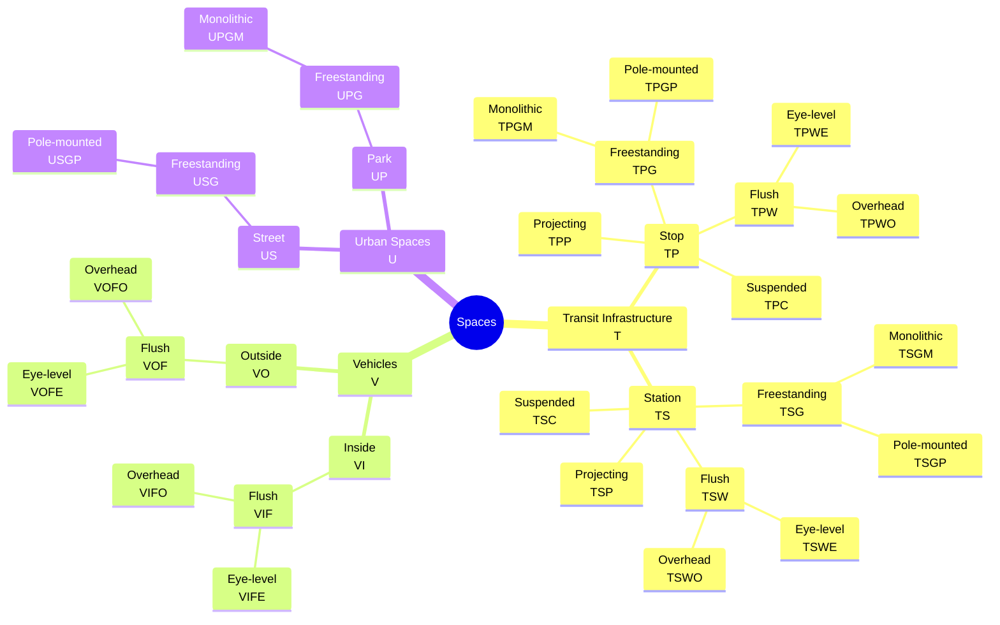
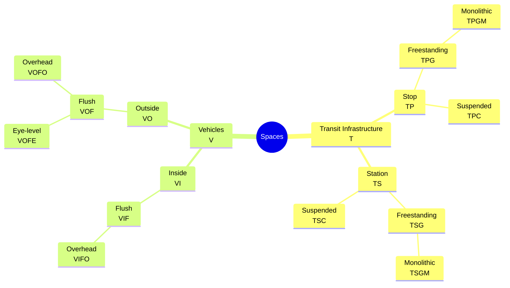

# Señalética

Una de los medios más importantes de comunicación es la señalización que permite la orientación en el espacio de las personas usuarias del servicio, también conocido como _señalética_.

La lógica de implementación está basada en el **modelo del servicio**, en el cual los pasajeros ocupan ciertos espacios antes, durante y después de su viaje. Estos espacios deben tener apropiada señalización para la orientación espacial y la información general, la cual está colocada en distintos formatos y tipos de montaje.

## Señalización impresa

### Imágenes de ejemplo

1. `tpc.png` (transit infrastructure / stop / suspended)
2. `tpgp.png` (transit infrastructure / stop / freestanding / pole-mounted)
3. `tpgm.png` (transit infrastructure / stop / freestanding / monolithic)
4. `tpwe.png` (transit infrastructure / stop / flush / eye-level)
5. `tpwo.png` (transit infrastructure / stop / flush / overhead)
6. `tpp.png` (transit infrastructure / stop / projecting)
7. `tsc.png` (transit infrastructure / station / suspended)
8. `tsgp.png` (transit infrastructure / station / freestanding / pole-mounted)
9. `tsgm.png` (transit infrastructure / station / freestanding / monolithic)
10. `tswe.png` (transit infrastructure / station / flush / eye-level)
11. `tswo.png` (transit infrastructure / station / flush / overhead)
12. `tsp.png` (transit infrastructure / station / projecting)
13. `vife.png` (vehicle / inside / flush / eye-level)
14. `vifo.png` (vehicle / inside / flush / overhead)
15. `vofe.png` (vehicle / outside / flush / eye-level)
16. `vofo.png` (vehicle / outside / flush / overhead)
17. `usgp.png` (urban space / street / freestanding / pole-mounted)
18. `upgm.png` (urban space / park / freestanding / monolithic)

## Señalización digital

### Imágenes de ejemplo

1. `screen_tpc.png` (transit infrastructure / stop / suspended)
2. `screen_tpgm.png` (transit infrastructure / stop / freestanding / monolithic)
3. `screen_tsc.png` (transit infrastructure / station / suspended)
4. `screen_tsgm.png` (transit infrastructure / station / freestanding / monolithic)
5. `screen_vifo.png` (vehicle / inside / flush / overhead)
6. `screen_vofo.png` (vehicle / outside / flush / overhead)
7. `screen_vofe.png` (vehicle / outside / flush / eye-level)
