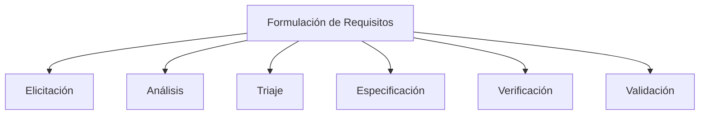

# Requisitos y propiedades

::: info Puntos clave

- Los requisitos del sistema, basado en las necesidades de los sistemas de información del transporte público, permiten tomar las decisiones de diseño y desarrollo de la arquitectura tecnológica.
- Las propiedades del sistema permiten implementar...
- En esta propuesta, los requisitos se estructuran en funcionales, no funcionales y de rendimiento, respondiendo a la realidad sociotécnica costarricense.
- La implementación considera metodologías iterativas, herramientas de trazabilidad y validación con múltiples partes interesadas, garantizando alineación con necesidades reales y factibilidad técnica.

:::

## Requisitos

### Teoría: ¿Qué es la formulación de requisitos?

La **formulación de requisitos** es el proceso mediante el cual se identifican, documentan y validan las necesidades de un sistema, con el fin de transformarlas en especificaciones técnicas claras y verificables. Es una etapa crítica en el ciclo de vida de sistemas complejos, particularmente en entornos sociotécnicos como el transporte público, donde intervienen múltiples actores con intereses diversos.

Los requisitos deben clasificarse adecuadamente:

- **Requisitos funcionales**: qué debe hacer el sistema (acciones, procesos, interacciones).
- **Requisitos no funcionales**: cómo debe comportarse el sistema (rendimiento, seguridad, accesibilidad, etc.).
- **Requisitos de rendimiento**: métricas cuantitativas que aseguran eficiencia operativa.

Además, se debe asegurar que cada requisito sea:

- **Claro**: sin ambigüedad.
- **Trazable**: conectable con sus fuentes y resultados.
- **Verificable**: medible o comprobable.
- **Factible**: dentro de las capacidades técnicas, económicas y temporales del proyecto.

---

### Requisitos para el sistema de transporte inteligente

#### Requisitos funcionales

1. Registro, monitoreo y localización en tiempo real de unidades mediante GPS y redes móviles.
2. Consulta pública de rutas, horarios y tiempos de llegada por aplicación web o móvil.
3. Gestión y validación de datos por parte del Consejo de Transporte Público (CTP) y la ARESEP.
4. Canal de alertas automáticas por emergencias enviado desde la CNE.
5. Módulo de retroalimentación ciudadana gestionado por las municipalidades.

#### Requisitos no funcionales

1. Escalabilidad para integrar nuevos operadores o municipalidades sin rediseño estructural.
2. Cumplimiento con [WCAG 2.1](https://www.w3.org/TR/2025/REC-WCAG21-20250506/) en accesibilidad digital.
3. Soporte multilingüe: español e inglés como mínimo.
4. Alta disponibilidad (>99%) y mecanismos de recuperación ante fallos.
5. Cumplimiento con la [Ley 8968 de protección de datos](https://www.pgrweb.go.cr/scij/Busqueda/Normativa/Normas/nrm_texto_completo.aspx?param1=NRTC&nValor1=1&nValor2=70975&nValor3=85989&strTipM=TC).

#### Requisitos de rendimiento

1. Visualización de datos para al menos 5,000 unidades móviles concurrentes.
2. Actualización de ubicación en menos de 3 segundos.
3. Compatibilidad con dispositivos móviles con conectividad 3G o superior.
4. Notificación de eventos críticos en un plazo máximo de 60 segundos.

---

### Proceso de formulación de requisitos

#### Etapas clave

1. **Elicitación**  
   Recolección de necesidades mediante entrevistas semiestructuradas, encuestas, análisis de procesos actuales y benchmarking (ej. Transantiago, Moovit).

2. **Análisis**  
   Depuración, categorización y eliminación de ambigüedades o contradicciones en los requisitos.

3. **Triaje**  
   Priorización de requisitos con base en restricciones presupuestarias, impacto e implicaciones técnicas o sociales.

4. **Especificación**  
   Redacción formal y estructurada de los requisitos, organizada por tipo y sin ambigüedades.

5. **Verificación**  
   Evaluación de los requisitos en cuanto a completitud, trazabilidad, consistencia y verificabilidad.

6. **Validación**  
   Confirmación con partes interesadas de que los requisitos reflejan fielmente sus necesidades.

---

### Restricciones contextuales en Costa Rica

- **Presupuesto limitado**: Es esencial priorizar mediante triaje y adoptar metodologías ágiles.
- **Fragmentación operativa**: La presencia de más de 300 operadores requiere un diseño modular e interoperable.
- **Infraestructura desigual**: El sistema debe adaptarse a zonas con baja o intermitente conectividad.
- **Marco legal en evolución**: Se deben prever mecanismos de actualización normativa y técnica.

---

### Herramientas y metodologías recomendadas

- **QFD (Quality Function Deployment)**: Mapeo de necesidades de las personas usuarias hacia requisitos técnicos.
- **SysML**: Lenguaje para modelado visual estructurado de requisitos.
- **Matriz de trazabilidad**: Asegura el vínculo entre requisitos, fuentes y entregables.
- **Prototipado rápido y pruebas de concepto**: Facilitan validaciones tempranas con las partes interesadas.

---

### Conclusión

La formulación de requisitos para un sistema sociotécnico como el transporte público inteligente en Costa Rica es clave para su éxito. Al integrar un proceso estructurado, herramientas de modelado, metodologías ágiles y validaciones con las partes interesadas, se asegura la viabilidad técnica, económica y social del sistema.

---

### Referencias

<Citation doi="10.1007/978-3-030-81159-4" />  
<Citation doi="10.1007/978-3-642-12578-2" />  
<Citation doi="10.1007/978-3-031-62194-9" />  
<Citation doi="10.1007/978-3-031-57327-9" />  
[WCAG 2.1](https://www.w3.org/TR/2025/REC-WCAG21-20250506/)  
[Ley 8968 de protección de datos](https://www.pgrweb.go.cr/scij/Busqueda/Normativa/Normas/nrm_texto_completo.aspx?param1=NRTC&nValor1=1&nValor2=70975&nValor3=85989&strTipM=TC)

## Propiedades

::: info Puntos clave

- Esta sección presenta las propiedades deseadas para el sistema de información.
- Estas propiedades se recopilan a partir de normas internacionales para la calidad del producto y referencias sobre transporte público inteligente y sistemas de ingeniería.
- Apuntar a estas propiedades en el sistema es fundamental para asegurar lo más posible el éxito del sistema y alargar su vida útil gracias a que este es flexible , interoperable, accesible y sostenible.
- En esta propuesta, las propiedades deben ser parte fundamental en el diseño, composición y toma de desiciones respecto al sistema de información.
  :::

- Asignación: Darío Guzmán
- Enfoque: desde la perspectiva de las propiedades deseadas del sistema y de su aplicación, cuáles son las propiedades que se deben considerar para el diseño y operación del sistema de información de transporte público inteligente.

### Teoría sobre propiedades y aplicación en el transporte público

Un sistema de ingeniería está basado en una interconexión compleja de distintos subsistemas que trabajan en conjunto para brindar un servicio y cumplir con requisitos de funcionalidad. El transporte público inteligente por si mismo en un subsistema de ingeniería, que parte de un gran sistema como lo son las ciudades inteligentes [1]. Como un sistema de ingeniería, este debe cumplir con ciertos requerimientos que no impactan directamente en la funcionalidad del sistema, pero si en el éxito que se espera que tenga en un futuro, así como la ampliación de su ciclo de vida más allá de lo esperado.

> [!info] Propiedad
> Una propiedad se define como un atributo, cualidad o característica de alguna cosa en específico. Lo anterior hace referencia a la definición básica de una propiedad, pero en un sistema de ingeniería esta va más allá, ya que se especifican como requerimientos de diseño no funcionales [2]. De forma que, antes de empezar con el trabajo de montaje y diseño del sistema, es importante considerar antes las propiedades que se desean para ese sistema.

En esta sección se presentan las propiedades objetivo para el sistema de transporte público a diseñar. Muchas de estas están relacionadas directamente con el comportamiento informático interno (software), así como la interacción humana (personas usuarias, stakeholders y los desarrolladores) y ciclo de vida del sistema. Algunas propiedades deseadas para un sistema de transporte público se muestran en el cuadro que se muestra a continuación. Muchas de estas están definidas según la norma ISO-25000 para la calidad del software y otras según el handbook sobre sistemas de ingeniería [2].

| Propiedad           | Descripción breve                                                                                         |
| ------------------- | --------------------------------------------------------------------------------------------------------- |
| Flexibilidad        | Capacidad del sistema para operar por largos períodos sin fallas [4]                                      |
| Accesibilidad       | Facilidad de acceso para las personas usuarias previstas [2]                                              |
| Tiempo de respuesta | Rapidez con la que el sistema reacciona a entradas [2]                                                    |
| Seguridad           | Protección contra accesos no autorizados y fallas [4]                                                     |
| Mantenibilidad      | Facilidad para realizar mantenimiento y actualizaciones al software o sistema [4]                         |
| Interoperabilidad   | Capacidad de comunicación existente entre los distintos “órganos” y utiliar información intercambiada [4] |
| Sostenibilidad      | El sistema de ser capaz de ser rentable durante su ciclo de vida [2]                                      |

Muchas de estas propiedades están directamente relacionadas directamente por qué rumbo se desea que vaya el sistema. Por ejemplo, en el caso de la **flexibilidad**, esta está enfocada en la capacidad que tendrá el sistema para mantener su funcionamiento independientemente del dipo de tecnología [3]. Es decir que, por ejemplo la transmisión de la información de los horarios, contratiempos, rutas entre otras puedan ser capaces de transmitirse por diversos medios como páginas web, aplicaciones entre otras. También el método de pago ya que, en la era digital, el dinero en efectivo es cada vez menos usado para el pago de transporte, es por ello que, el sistema debe ser flexible para tolerar tanto pago efectivo como digital.

Por otra parte, la **seguridad** es un factor muy importante para la aplicación de un sistema de transporte que amerite el pago del servicio a través medios digitales como tarjetas. Es un sistema que debe mantener su operación y soporte durante todo el tiempo de operación y, además, mantenerse lo menos interrumpido posible para evitar angustias a los pasajeeros.

No obstante, la propiedad más sonada dentro de las mencionadas es la **interoperabilidad**, la cual se define como la capacidad de comunicación existente entre los distintos “órganos”. De esto deriva la flexibilidad del sistema, propiedad ya anteriormente desarrollada. El sistema debe funcionar independientemente de la tecnología aplicada a su diseño. Dada la gran cantidad de relaciones de sistemas y subsistemas, la interoperabilidad es la principal propiedad que, permitirá la perduración del sistema más allá del ciclo de vida estimado [1].

### ¿Por qué estas propiedades?

Estas propiedades se consideran deseables ya que representan la parte más básica deseable para el funcionamiento de un sistema. Por ejemplo, la **interoperabilidad**. El sistema debe ser capaz de interactuar con sistemas externos para recopilar datos especializados independientemente del tipo de tecnología. La **sostenibilidad** porque el sistema debe ser rentable en el tiempo, debe ser sostenible para asegurar su funcionalidad durante todo su tiempo de vida. Respecto a la **mantenibilidad**, el sistema debe ser capaz de recibir mantenimiento efectivo que asegure su operación sin interrupciones mayores. Por parte de la seguridad, el sistema, al planear que posea un método de pago dual y flexible, debe ser seguro en el caso de pagos por métodos digitales como tarjetas de debido/crédito.

Respecto a aspectos como el **tiempo de respuesta**, el sistema, al utilizar distintas herramientas de comunicación como páginas web u otro tipo de elementos para indicaar horas de llegada, retrasos, desvíos, emergencias, entre otras, debe ser capaz de indicar a los personas usuarias estas alertas y actualizar los datos en el menor tiempo posible para garantizar una buena experiencia. Relacionado con todo lo que se ha mencionado, el sistema debe ser principalmente flexible. Es decir que, es una propiedad que es indicspensable para mantener una buena relación con el factor humano del sistema que, según [2] es uno de los retos de los sistemas de ingeniería.

### Propuesta de propiedades basadas en la norma [ISO/IEC 25010](https://iso25000.com/index.php/normas-iso-25000/iso-25010)

para la calidad del software
Como bien es esperable, un sistema de transporte público ingeligente moderno debe operar de acuerdo con la interacción de sistemas informáticos y de software. El software necesario para un sistema de ingeniería debe cumplir con parámetros de calidad que indican el cómo el producto logra satisfacer las necesidades de las personas usuarias. Esta necesidad de software de calidad está directamente relacionada con algunas propiedades deseadas para el sistema. En el siguiente cuadro se muestran las características de calidad según la norma [ISO/IEC 25010](https://iso25000.com/index.php/normas-iso-25000/iso-25010).

| adecuación funcional  | eficiencia de desempeño | compatibilidad    | capacidad de interacción               | fiabilidad          | seguridad        | mantenibilidad              | flexibilidad     | protección                |
| --------------------- | ----------------------- | ----------------- | -------------------------------------- | ------------------- | ---------------- | --------------------------- | ---------------- | ------------------------- |
| completitud funcional | comportamiento temporal | coexistencia      | reconocibilidad de adecuación          | ausencia de fallos  | confidencialidad | modularidad                 | adaptabilidad    | restricción operativa     |
| corrección funcional  | utilización de recursos | interoperabilidad | aprendibilidad                         | disponibilidad      | integridad       | reusabilidad                | escalabilidad    | identificación de riesgos |
| pertinencia funcional | capacidad               |                   | operabilidad                           | tolerancia a fallos | no-repudio       | analizabilidad              | instalabilidad   | protección ante fallos    |
|                       |                         |                   | protección frente a errores de usuario | recuperabilidad     | responsabilidad  | capacidad de ser modificado | reemplazabilidad | advertencia de peligro    |
|                       |                         |                   | involucración del usuario              |                     | autenticidad     | capacidad de ser probado    |                  | integración segura        |
|                       |                         |                   | inclusividad                           |                     | resistencia      |                             |                  |                           |
|                       |                         |                   | asistencia al usuario                  |                     |                  |                             |                  |                           |
|                       |                         |                   | auto-descriptividad                    |                     |                  |                             |                  |                           |

Al realizar una comparativa entre el cuadro I de propiedades deseadas y el cuadro II extraído de la norma [ISO/IEC 25010](https://iso25000.com/index.php/normas-iso-25000/iso-25010), muchas de las propiedades deseadas son parte de las necesarias para el desarrollo de sistemas de software de calidad, que directamente son aplicadas a sistemas de ingeniería más complejos. El enfoque principal desde la perspectiva de las propiedades debe ser la interoperabilidad y la flexibilidad como se muestra en el siguiente diagrama.

<!-- # Conclusiones
A partir de la exploración realizada, es sencillo concluir que el enfoque de las propiedades para el desarrollo del transporte público en Costa Rica está orientado a incentivar el desarrollo tecnológico en el ámbito del transporte siguiendo como principal propiedad la interoperabilidad y la flexibilidad del sistema.

Por otra parte es importante concluir que, tanto la flexibilidad como la interoperabilidad son dos propiedades sumamente fundamentalers que, según [2] son importantes para el éxito y la extensión de la vida útil del sistema de ingeniería.

A su vez, se infiere que, las normas para los sistemas de ingeniería, son la base que indican las propiedades importantes para el desarrollo del sistema y asegurar la calidad del mismo. Como es el caso de la norma ISO que, indica las propiedades necesarias para la calidad del desarrollo de software. Y, esto es indispensable ya que, gran parte de las interacciones del sistema de transporte inteligente se basan en software.-->

### Referencias

[1] Bubelíny, O., & Kubina, M. (2021). Impact of the concept Smart City on public transport. Transportation Research Procedia, 55, 1361-1367.

[2] Maier, A., Oehmen, J., & Vermaas, P. E. (Eds.). (2022). Handbook of Engineering Systems Design. Springer.

[3] Abarca, F., Murillo, J. D., Segura, D., Vargas, J., Cordero, A., Murillo, E., ... & Coto, M. (2024, November). A System-Level Design for a Public Transportation Information System in Costa Rica. In 2024 IEEE 42nd Central America and Panama Convention (CONCAPAN XLII) (pp. 1-7). IEEE.
<Citation doi="10.1007/978-3-030-81159-4" />

[4] ISO/IEC, "ISO/IEC 25010:2011 — Systems and software engineering — Systems and software Quality Requirements and Evaluation (SQuaRE) — System and software quality models," International Organization for Standardization, 2011. [Online]. Available: https://www.iso25000.com/index.php/normas-iso-25000/iso-25010
