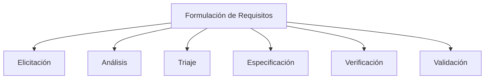

::: Puntos clave

- Esta sección presenta los requisitos para el diseño e implementación de un sistema de información para transporte público inteligente en Costa Rica.
- La formulación adecuada de requisitos es esencial para garantizar el éxito técnico y la aceptación social del sistema.
- En esta propuesta, los requisitos se estructuran en funcionales, no funcionales y de rendimiento, respondiendo a la realidad sociotécnica costarricense.
- La implementación considera metodologías iterativas, herramientas de trazabilidad y validación con múltiples partes interesadas, garantizando alineación con necesidades reales y factibilidad técnica.

:::

## Teoría: ¿Qué es la formulación de requisitos?

La **formulación de requisitos** es el proceso mediante el cual se identifican, documentan y validan las necesidades de un sistema, con el fin de transformarlas en especificaciones técnicas claras y verificables. Es una etapa crítica en el ciclo de vida de sistemas complejos, particularmente en entornos sociotécnicos como el transporte público, donde intervienen múltiples actores con intereses diversos.

Los requisitos deben clasificarse adecuadamente:

- **Requisitos funcionales**: qué debe hacer el sistema (acciones, procesos, interacciones).
- **Requisitos no funcionales**: cómo debe comportarse el sistema (rendimiento, seguridad, accesibilidad, etc.).
- **Requisitos de rendimiento**: métricas cuantitativas que aseguran eficiencia operativa.

Además, se debe asegurar que cada requisito sea:

- **Claro**: sin ambigüedad.
- **Trazable**: conectable con sus fuentes y resultados.
- **Verificable**: medible o comprobable.
- **Factible**: dentro de las capacidades técnicas, económicas y temporales del proyecto.

---

## Requisitos para el sistema de transporte inteligente

### Requisitos funcionales

1. Registro, monitoreo y localización en tiempo real de unidades mediante GPS y redes móviles.
2. Consulta pública de rutas, horarios y tiempos de llegada por aplicación web o móvil.
3. Gestión y validación de datos por parte del Consejo de Transporte Público (CTP) y la ARESEP.
4. Canal de alertas automáticas por emergencias enviado desde la CNE.
5. Módulo de retroalimentación ciudadana gestionado por las municipalidades.

### Requisitos no funcionales

1. Escalabilidad para integrar nuevos operadores o municipalidades sin rediseño estructural.
2. Cumplimiento con [WCAG 2.1](https://www.w3.org/TR/2025/REC-WCAG21-20250506/) en accesibilidad digital.
3. Soporte multilingüe: español e inglés como mínimo.
4. Alta disponibilidad (>99%) y mecanismos de recuperación ante fallos.
5. Cumplimiento con la [Ley 8968 de protección de datos](https://www.pgrweb.go.cr/scij/Busqueda/Normativa/Normas/nrm_texto_completo.aspx?param1=NRTC&nValor1=1&nValor2=70975&nValor3=85989&strTipM=TC).

### Requisitos de rendimiento

1. Visualización de datos para al menos 5,000 unidades móviles concurrentes.
2. Actualización de ubicación en menos de 3 segundos.
3. Compatibilidad con dispositivos móviles con conectividad 3G o superior.
4. Notificación de eventos críticos en un plazo máximo de 60 segundos.

---

## Proceso de formulación de requisitos

### Etapas clave

1. **Elicitación**  
   Recolección de necesidades mediante entrevistas semiestructuradas, encuestas, análisis de procesos actuales y benchmarking (ej. Transantiago, Moovit).

2. **Análisis**  
   Depuración, categorización y eliminación de ambigüedades o contradicciones en los requisitos.

3. **Triaje**  
   Priorización de requisitos con base en restricciones presupuestarias, impacto e implicaciones técnicas o sociales.

4. **Especificación**  
   Redacción formal y estructurada de los requisitos, organizada por tipo y sin ambigüedades.

5. **Verificación**  
   Evaluación de los requisitos en cuanto a completitud, trazabilidad, consistencia y verificabilidad.

6. **Validación**  
   Confirmación con partes interesadas de que los requisitos reflejan fielmente sus necesidades.

---

## Restricciones contextuales en Costa Rica

- **Presupuesto limitado**: Es esencial priorizar mediante triaje y adoptar metodologías ágiles.
- **Fragmentación operativa**: La presencia de más de 300 operadores requiere un diseño modular e interoperable.
- **Infraestructura desigual**: El sistema debe adaptarse a zonas con baja o intermitente conectividad.
- **Marco legal en evolución**: Se deben prever mecanismos de actualización normativa y técnica.

---

## Herramientas y metodologías recomendadas

- **QFD (Quality Function Deployment)**: Mapeo de necesidades de las personas usuarias hacia requisitos técnicos.
- **SysML**: Lenguaje para modelado visual estructurado de requisitos.
- **Matriz de trazabilidad**: Asegura el vínculo entre requisitos, fuentes y entregables.
- **Prototipado rápido y pruebas de concepto**: Facilitan validaciones tempranas con las partes interesadas.

---

## Conclusión

La formulación de requisitos para un sistema sociotécnico como el transporte público inteligente en Costa Rica es clave para su éxito. Al integrar un proceso estructurado, herramientas de modelado, metodologías ágiles y validaciones con las partes interesadas, se asegura la viabilidad técnica, económica y social del sistema.

---

## Referencias

<Citation doi="10.1007/978-3-030-81159-4" />  
<Citation doi="10.1007/978-3-642-12578-2" />  
<Citation doi="10.1007/978-3-031-62194-9" />  
<Citation doi="10.1007/978-3-031-57327-9" />  
[WCAG 2.1](https://www.w3.org/TR/2025/REC-WCAG21-20250506/)  
[Ley 8968 de protección de datos](https://www.pgrweb.go.cr/scij/Busqueda/Normativa/Normas/nrm_texto_completo.aspx?param1=NRTC&nValor1=1&nValor2=70975&nValor3=85989&strTipM=TC)
