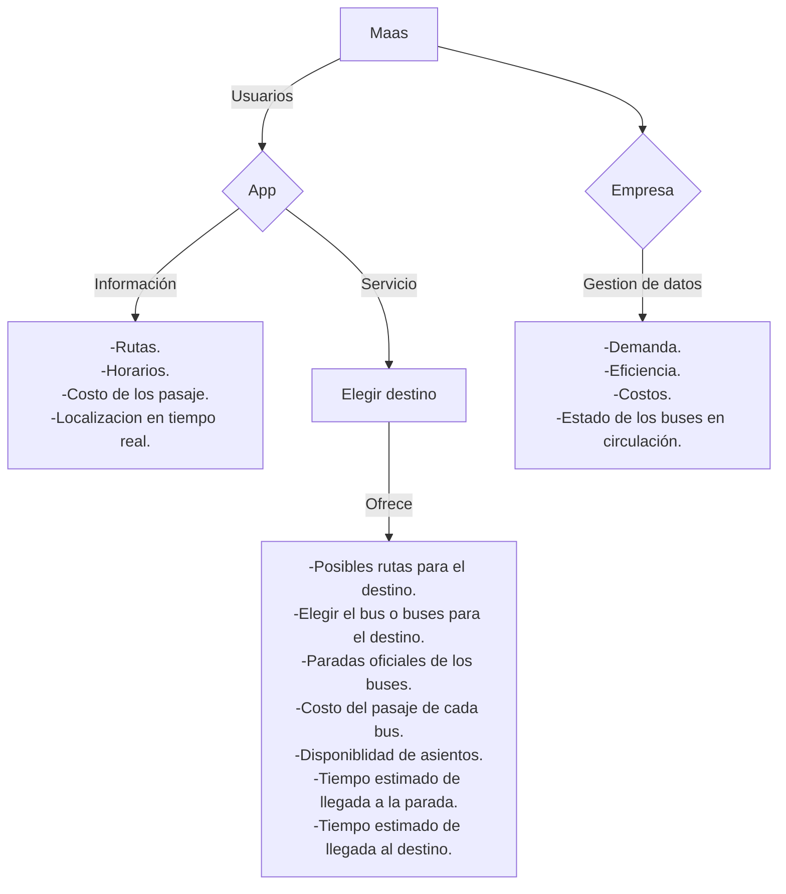

## Movilidad como Servicio (MaaS)

- Esta sección expone cómo el transporte público inteligente en Costa Rica puede evolucionar hacia un modelo de **sistema de sistemas**, donde la interoperabilidad digital y la coordinación entre actores permiten ofrecer servicios integrados y centrados en el usuario.

- La importancia de este enfoque radica en que crea la base necesaria para la implementación de MaaS, al permitir la conexión fluida entre modos de transporte, plataformas digitales, gestión de datos y experiencia del usuario.

- La propuesta plantea el uso de tecnologías como Big Data, IoT, pagos digitales y plataformas móviles para mejorar la eficiencia operativa, el acceso a la información y la toma de decisiones en tiempo real.

- Esta transformación digital no solo mejora la experiencia del usuario, sino que reorganiza el ecosistema del transporte público, promoviendo una gestión coordinada entre operadores, autoridades y plataformas tecnológicas, lo que permite una evolución estructural hacia un sistema MaaS sostenible, eficiente y escalable.

### Definicion de MaaS

La Movilidad como Servicio o *Mobility as a Service* (**MaaS**) es un modelo de transporte que integra servicios públicos y privados en una plataforma digital única, permitiendo a los usuarios planificar, reservar, pagar y gestionar viajes multimodales. Su objetivo es simplificar la movilidad, reducir la fragmentación entre operadores y mejorar la eficiencia del transporte.

### Beneficios del MaaS

**Para usuarios**:  
Mayor comodidad, ahorro de tiempo y costos a través de una accesibilidad sencilla a la información completa del transporte público y sus servicios.

**Para operadores y gobiernos**:  
Optimización de redes, datos para mejorar la infraestructura, reducción de congestión y emisiones.

### Digitalización en MaaS

- **Plataformas digitales**: Centralizan la planificación, reserva y pago de viajes.
- **Gestión de datos**: Datos de viajes ayudan a optimizar rutas y servicios.
- **Disrupción tecnológica**: Servicios bajo demanda, movilidad compartida y precios dinámicos.
- **Experiencia de usuario**: Interfaz sencilla, personalización y transacciones en tiempo real.

#### Tecnologías clave

- IoT (dispositivos conectados para integración de servicios).
- Smartphones y 4G/5G (acceso a apps como Whim).
- Pagos sin efectivo (transacciones rápidas).

Es evidente que la digitalización en el sector de la movilidad tiene un gran potencial, ya que cubre gran parte de las necesidades planteadas y cualquier mínima implementaciones estas tecnologías pueden aportar gran avance en el transporte.

## El transporte público inteligente como un sistema de sistemas

La digitalización ha transformado los sistemas de transporte tradicionales en **sistemas de sistemas**, donde múltiples plataformas, tecnologías y actores interactúan para ofrecer servicios más integrados, eficientes y centrados en el usuario. En este contexto, Costa Rica tiene la oportunidad de avanzar hacia un modelo MaaS, que integra diferentes modos de transporte en una única plataforma digital, facilitando su planificación, reserva y pago. 

Un sistema de transporte inteligente no se basa solo en tener autobuses eléctricos o estaciones inteligentes, sino en una infraestructura digital que conecte todos los elementos del **ecosistema de movilidad**: operadores de transporte, usuarios, infraestructura vial, datos en tiempo real, aplicaciones móviles y políticas públicas. Es aquí donde el transporte público inteligente actúa como un **sistema de sistemas**, integrando tecnologías como Big Data, inteligencia artificial, sensores IoT y plataformas en la nube.

### ¿Por qué el transporte público de Costa Rica necesita esta transición?

El Departamento de Asuntos Económicos y Sociales de la ONU en un informe del 2023 evidencio que en el año 2022 la demanda de transporte urbano ha continuado creciendo exponencialmente, mostrando una necesidad para el transporte público con el fin de lograr una mejorar aspectos como la accesibilidad, eficiencia y sostenibilidad en general. El Centro de Investigación del Transporte (TRANSyT) en un artículo sobre movilidad inteligente, remarco la movilidad tradicional es insostenible tiene varios problemas como lo es la contaminación por emisión de CO₂, congestionamiento, accesibilidad, entre otras.  En esa línea, el modelo de ciudad inteligente (*Smart City*) promueve una movilidad más sostenible gracias a herramientas como:

- **Big Data y Cloud**: analizan datos en tiempo real para mejorar rutas, reducir tiempo de viajes y emisiones.
- **Gestión inteligente del tráfico**: mediante sensores, semáforos adaptativos y estacionamientos inteligentes.
- **Logística urbana**: Plataformas digitales para seguimiento de flotas, cargas y control de operaciones.

 Este enfoque prepara el camino para la implementación de MaaS en Costa Rica, al sentar las bases tecnológicas y organizativas necesarias para la **interoperabilidad** entre servicios, la experiencia de usuario unificada y la toma de decisiones basada en datos actualizados. Sería el primer paso hacia un transporte público inteligente que permita al **ecosistema de movilidad** evolucionar como servicio ofreciendo soluciones básicas al ser más accesible, ágil y centrada en las personas. 
 
### Ejemplo implementeación de Maas

## Referencias

<Citation doi="10.3390/su14148962" />  
<Citation doi="10.1007/978-3-030-81159-4" />

Pérez Prada, Fiamma, Velázquez Romera, Guillermo, Fernández Áñez, María Victoria and Dorao Sánchez, Javier (2015). Movilidad Inteligente. "Economía Industrial" (n. 395); pp. 111-121. ISSN 0422-2784.

Naciones Unidas. (2023). The Sustainable Development Goals Report 2023: Informe sobre los Objetivos de Desarrollo Sostenible 2023.
