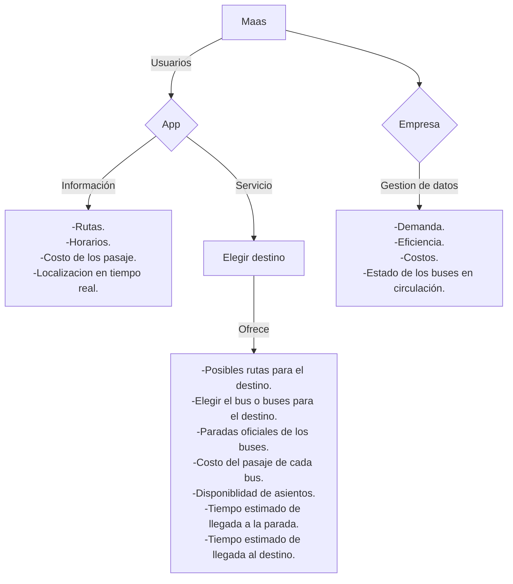

## Movilidad como Servicio (MaaS)

::: info Puntos clave

## Resumen de puntos clave
- Necesidad de mejorar el transporte público.
- Digitalización de la movilidad como posible solución.
- Implementación de la movilidad como servicio para mejorar la eficiencia y simplicidad del transporte público.
- Mejor acceso de la información del servicio para los clientes
- Mayor facilidad en gestión de datos como la demanda del servicio 
- Tecnologías claves como IoT, pagos sin efectivo, smartphones y 4G/5G.

:::

## El transporte público inteligente como un sistema de sistemas

La digitalización es una tendencia de este siglo que ha revolucionado muchos sectores de negocios por los beneficios que aportan. Los sistemas de movilidad han evolucionado por medio de la digitalización a sistemas tan complejos que se consideran **sistemas de sistemas**, logrando pasar de transporte tradicional a poder tener todo un **ecosistema digital** que ayuda a mejorar el producto y servicio, además de generar un valor como el procesamiento de datos y transformar el modelo de negocio del transporte por medio de la digitalización.

El Departamento de Asuntos Económicos y Sociales de la ONU en un informe del 2023 evidencio que en el año 2022 la demanda de transporte urbano ha continuado creciendo exponencialmente, mostrando una necesidad para el transporte público con el fin de lograr una mejorar aspectos como la accesibilidad, eficiencia y sostenibilidad en general. El Centro de Investigación del Transporte (TRANSyT) en un artículo sobre **movilidad inteligente**, remarco la movilidad tradicional es insostenible tiene varios problemas como lo es la contaminación por emisión de CO₂, congestionamiento, accesibilidad, entre otras. Comparado a la movilidad de *Smart Cities* la cuales por medio de digitalización del sector e implementaciones de **TICs** que logran un transporte más eficiente, sostenible e inclusivo: 

### Optimización del transporte

- **Big Data y Cloud**: Analizan datos en tiempo real para mejorar rutas, reducir emisiones y ahorrar tiempo.
- **Gestión inteligente del tráfico**: Sensores, estacionamientos inteligentes y sistemas de control dinámico.
- **Logística urbana**: Plataformas digitales para seguimiento de mercancías y flotas sostenibles.

## Definicion de MaaS

La Movilidad como Servicio (**MaaS**) es un modelo de transporte que integra servicios públicos y privados en una plataforma digital única, permitiendo a los usuarios planificar, reservar, pagar y gestionar viajes multimodales. Su objetivo es simplificar la movilidad, reducir la fragmentación entre operadores y mejorar la eficiencia del transporte.

### Beneficios del MaaS

**Para usuarios**:  
Mayor comodidad, ahorro de tiempo y costos a través de una accesibilidad sencilla a la información completa del servicio. 

**Para operadores y gobiernos**:  
Optimización de redes, datos para mejorar la infraestructura, reducción de congestión y emisiones.

### Digitalización en MaaS

- **Plataformas digitales**: Centralizan la planificación, reserva y pago de viajes.
- **Gestión de datos**: Datos de viajes ayudan a optimizar rutas y servicios.
- **Disrupción tecnológica**: Servicios bajo demanda, movilidad compartida y precios dinámicos.
- **Experiencia de usuario**: Interfaz sencilla, personalización y transacciones en tiempo real.
 
#### Tecnologías clave
  - IoT (dispositivos conectados para integración de servicios).
  - Smartphones y 4G/5G (acceso a apps como Whim).
  - Pagos sin efectivo (transacciones rápidas).

Es evidente que la digitalización en el sector de la movilidad tiene un gran potencial, ya que cubre gran parte de las necesidades planteadas y cualquier mínima implementaciones estas tecnologías pueden aportar gran avance en el transporte.

### Ejemplo gráfico

## Referencias

<Citation doi="10.3390/su14148962" />  
<Citation doi="10.1007/978-3-030-81159-4" />

Pérez Prada, Fiamma, Velázquez Romera, Guillermo, Fernández Áñez, María Victoria  and Dorao Sánchez, Javier (2015). Movilidad Inteligente. "Economía Industrial" (n. 395); pp. 111-121. ISSN 0422-2784.

Naciones Unidas. (2023). The Sustainable Development Goals Report 2023: Informe sobre los Objetivos de Desarrollo Sostenible 2023.
